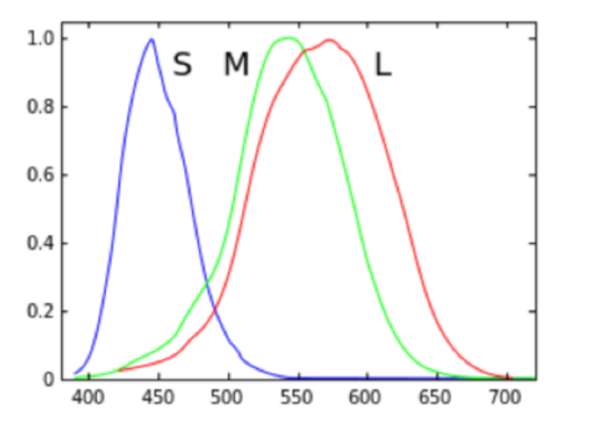
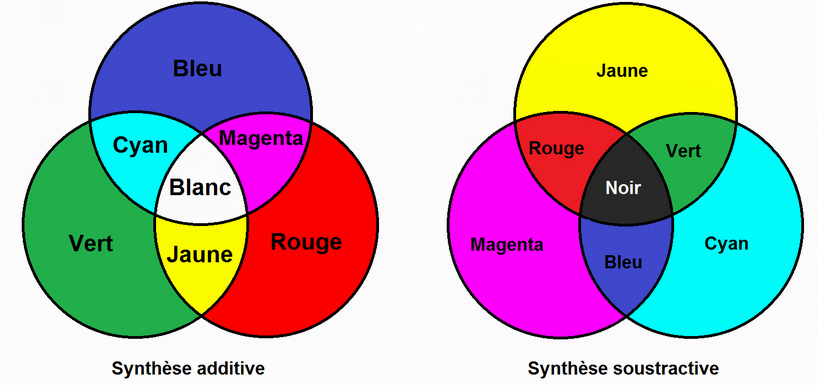

# Q2 HVS. Explain the fundamentals of color vision.  Explain the additive and subtractive color mixings.

Explain the fundamentals of color vision.

Objectivement, on peut distinguer
La lumière acromatic (sans couleur): caractérisé par l'intensité de la lumière. cela varie entre noir et blanc avec des nuances de gris
La lumière cromatique (couleur): qui sert à distinguer et percevoir les couleurs

**Cela est caractérisé par 3 grandeurs**
1. **Radiance** c'est la quantité totale d'énergie emmise par une source lumineuse (mesuré en Watt).
2. **Liminance** est une mesuer de la quatité d'énergie qu'un observateur perçois depuis la source lumineuse. on peut considéré cela philtré par l'oeil humain (lumens)
3. **Brightness** est une évaluation subjective de ce qu'est la source de radiation dont nous parlons.

**Il y a deux façon de considérer la vision des couleurs**
1. On peut le considéere comme une partie du spectre électromagnétique et depuis la perspective de la percéption par l'oeil humain et l'interpretation par le cerveau humain.
2. On peut le considérer comme une part de la façon dont la couleur est créée en tant que tell par les couleur primaire ou par le mélange des couleur (composition additive/soustractive)

La couleur est la façon dont nos yeux et notre cerveau perçoivent la lumière.
La lumière est une onde et comme tout type d'onde, chaque particule, a une logueur d'onde.
Techniquement, le champ de vision des êtres humains est très étroit comparé au spectre électromagnétique entier

La couleur que nous voyons est basée sur des longueurs d'ondes de la lumière. Aussi, plus il y a de lumière, plus on voit de couleurs. La plus part des coleur sont une combinaison de plusieurs longeurs d'ondes.

exemple du blanc et du prisme de Newton.

La couleur est perçue quand la lumière atteint les cônes de nos yeux.

**3 types de cones**
Chacun des trois type de cônes sont sensibles à des longeurs d'onde de mesure différentes.

L-cones – sensible à  high-wavelength
M-cones – sensible à  medium-wavelength
S-cones – sensible à  short-wavelength

In normal human most of receptors are Red colors(%65)
%65 “Red”(not exact)
%33 “Green”(not exact)
2%  “Blue” (not exact)

Mais dans les caméra digitals on a deux fois plus de récepteur vert que le reste.
La plus grande concentration de récepteurs pour une personne normale se trouve dans la Fovea et pas ailleurs dans la rétine.

Les cônes sont codés dans l'ADN (le dalotnisme est potentiellement d'origine génétique)
Soit la personne n'a pas tout les type de cône soit ceux-ci sont endommagés.

The distribution of cone cells in the fovea of a person with
normal color vision (left) and a colorblind (protanopic) retina.

**Conclusion:**
Il n'y a pas de cône S dans la fovea.
Les daltoniens n'ont pas de cône L

**Explain the additive and subtractive color mixings.**
Additive color mixings:
La combinaison devint plus claire à mesure qu'on ajoute des couleurs.

subtractive color mixings:
La combinaision devient plus sombre à mesure qu'on ajoute des couleurs.

