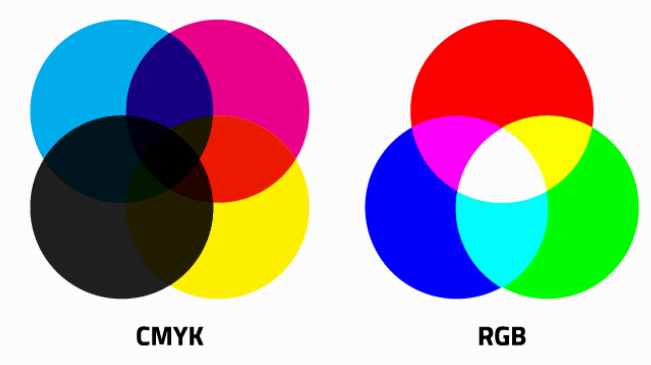
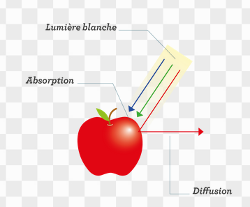
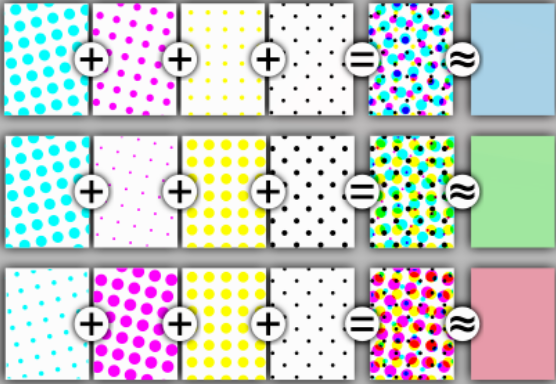

# Q3 HVS. Explain the CMYK model.
C'est pour:
- cyan
- Magenta
- yellow (jaune)
- black (on retient seulement le k pour une raison qu j'ignore)

Contrairement au RGB (red, green, blue) qui servent à afficher/représenter les coureurs sur un écran.
Alors que RGB est une composition additive, Le CMYK est une composition soustractive.
CMYK représente les pigments de couleur alors que le rgb représente la lumière.
La couleure noir est un supplément car elle coûte peu à produir et prend moins de temps pour imprimer du papier.

**Exemplify the reflection of colors.**
Exemple avec une pomme. un objet blanc et noir.

**Explain the principles of halftoning.**
Chaque petit point des couleurs primaires sont imprimé sur la surface de choix et c'est l'oeil humain qui perçoit la combinaison des couleurs.
Le halftoning permet de pouvoir représenter un plus grand champ de couleur (cela permet de faire des "nuances").

