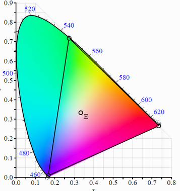

# Q4 HVS. Explain the chromaticity color diagram.
All physiquly existing colors appeared on this normalized x, y plain.

**teinte (hue)**: est la fréquence dominante, elle indique laquelle des couleurs principales est mise en avant.

**Saturation (saturation)**: Indique la quantité de blanc contenu dans la couleur.

**brillance (brightness)**: Est un attribut de perception visuelle dans laquelle la source semble projeter de la lumière. Attribut subjectif de l'objet observé.

La gamme (gamut) est tout le champ de couleur atteignable par un système d'imagerie. Chaque couleur peut être représenté par une paire de coordonnées.
ça peut nous aider à voir comment différente couleur se mélangent.

**What is the achievable color gamut?**
Le champ des couleurs atteignable selon le diagram est vraiment grand (il représente toutes les courleurs visibles du spectre électromagnétique).

**Which factors determine the achievable color gamut for the screens and printers?**

Le Gamut de l'écran est plus large que le gamut de l'imprimante. L'imprimante peut reproduire moins de couleur.
