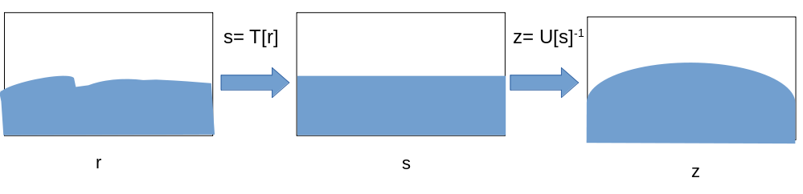
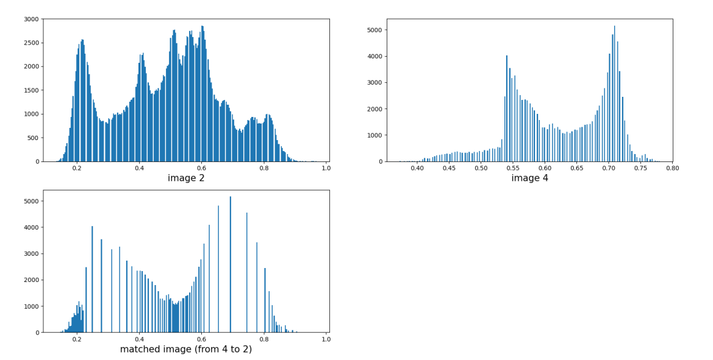
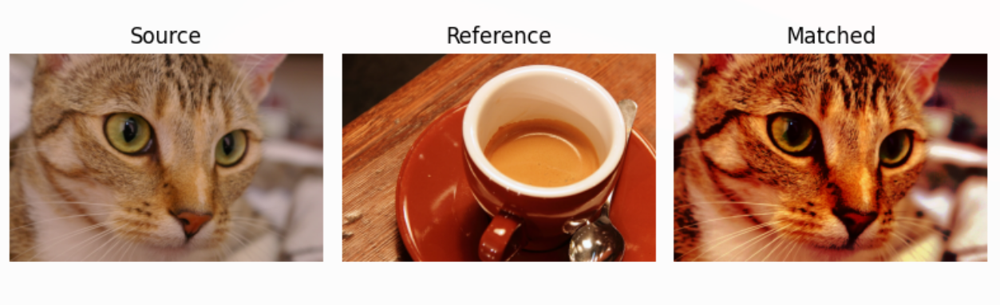

# Q10 Histogram transformation. Explain and exemplify the example of histogramme matching.

C'est une transformation non-linéaire qui permet de transformer notre histograme de départ en un histograme aillant une certaine forme.

**Méthode:**

Pour ce faire, on ne trouve pas une transformation directe mais on passe par des étapes.
On s'appuie fondamentalment sur la transformation appelée histogram equalization.

Si on veut transformer un histograme de départ (sur r) en un histogram cible (sur z), il nous suffit de d'utiliser les transformations T(r->s) et U(z->s) passant les deux histogrames à l'histograme uniforme.  
Comme l'histogram equalization est une transformation inversible, on peut alors Choisir U^-1(s->z) Comme le passage de l'histogram uniforme en l'histogram cible.  

Pour alors passer du départ à la cible, il suffira d'utiliser z= U^-1[T[r]]

**Exemples:**

