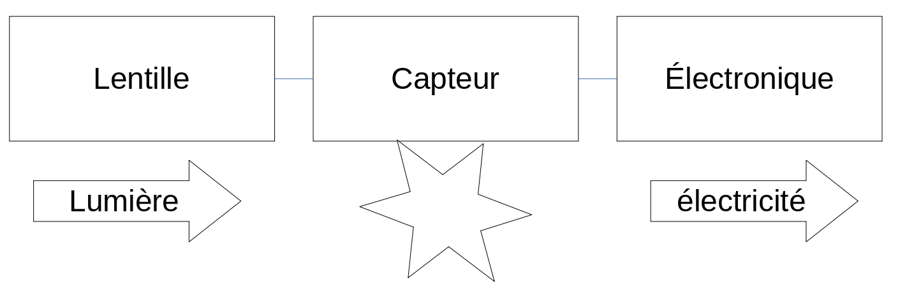
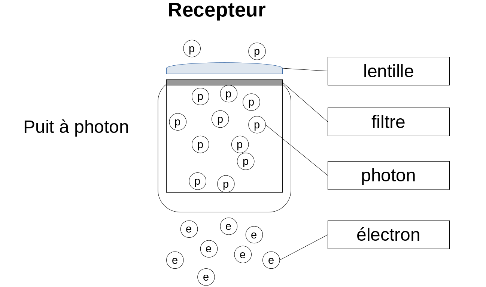

# Q5. Image acquisition
**Q5. Image acquisition** Explain the role of a sensor in imaging. Explain the principle of photon counting? Which size of sensors is of preference in practice? Explain the trade-offs.  

**Définition**
C'est la partie matérielle des appareils de captures d'image (compose l'imaging pipeline).
Vient juste après la lentille et avant la partie électronique.

**Son rôle:** (explain the role of a sensor in imaging)
    Conversion de la lumière (photon) En courant électrique (électrons).  
    C'est grâce à lui qu'on peu numériser des images.

**comptage de photons :** (explain the principle of photons counting)

1. Les photons sont capturés par la lentille et sont amenés au capteur (sensor).  2. Le capteur capture les photons dans des récepteurs qui vont les accumuler et les convertir grâce à l'effet photoélectrique (une propriété physique des photons qui permet d'arracher des électrons).

**gain quantique**
Pas tout les électrons produisent des photons.  
On appel gain quantique (quantum efficiency) le rapport de la quantité d'électrons créés par rapport à la quantité de photon reçu (car ces deux valeurs sont proportionnelles)

Exemple de gain quantique  
- vision humaine: about 15%
- caméra digitale typique: <50%
- pour le meilleur CCD: >90%
 
**Q= number of electrons/number of photon**

La qualité du comptage dépend de la taille et de la sensibilité du capteur.

**size of preferences**
Cela dépend du domaine d'application, pour le domaine des caméras professionnelles, on peut avoir des capteur assez grands qui peuvent mieux capter la lumière (car la taille des cellules pour les pixel est plus grande et peut accueillir plus de lumière).  
Pour le cas des petits appareils comme les téléphones portable, le capteur sera très petit car la caméra du télépohe sera elle aussi petite (cela peut poser des problèmes pour le comptage de photon).  

**Compromis** (explain the trade-off)
Dans l'actualité, on cherche beaucoup a miniaturiser les appareils pour des question de place, mais cela permet aussi d'augmenter la résolution (on a plus de pixel par surface). Le problème qu'on rencontre concerne le comptage des photons. En effet, si le capteur d'une cellule est petit, il attrape moins de photon et ça diminue la qualité de l'image.
rapport taille photons

**Notions:**  
full well: quantité max d'électron recevable  
effet photoélectrique: les photons arrache des électrons à chaque élément actif  
