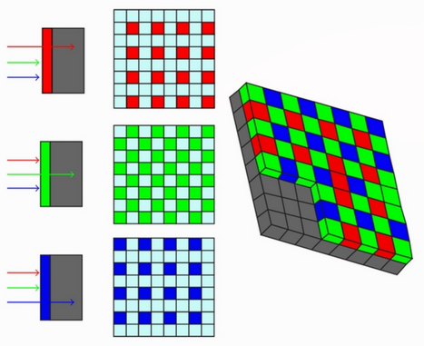
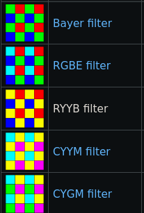
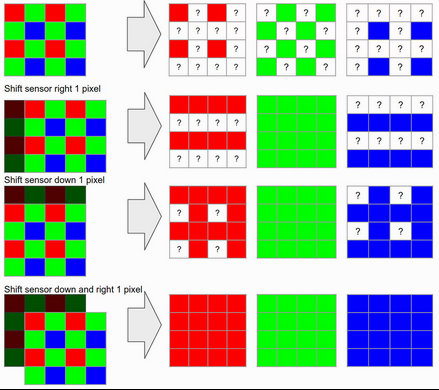

# Q8.  Image acquisition.  Explain the principles of modern color imaging.  What is a color filter array? What is the demosaicing?

Color imaging
Explain the principles of modern color imageing

(color imaging)

**Matrice de filtre colorés (What is color filter array?):**
Un capteur ne fait que de récolter les photons pour les attribuer à des pixel.  
Ce n'est seulement qu'une information d'intensité.  
On utilise des philtre coloré pour donner de la couleur.  
ils sont placés sur les photosites d'un capteur photographique pour permettre la sépartion des couleurs.  
Chaque pixel reçoit une couleur (cela dépend du philtre, comme Bayer, RGBE, etc) On crée finallement les caneaux de couleur en interpolant.  

**Dématriçage (demosaicing):**
Est une des phases du traitement du signal brut issu du capteur d'un appareil photographique numérique.
En effet, une image est d'abord enregistré comme une matrice représentant l'intensité lumineuse sans les couleurs. C'est comme un grayscale.

On utilise un filtre coloré pour attribuer à chaque valeur une couleur et on sépare l'image en trois chaînes de couleurs (habituellement RGB). Le problème est que chaque chanel va finir avec des trous. C'est pourquoi on utilise des technique d'interpolation pour combler les trous et se rapprocher des valeurs originelles de l'image.

Il consiste à `interpoler` les données de chacun des photosites monochromes rouge, vert et bleu composant le capteur électronique pour obtenir une valeur trichrome pour chaque pixel.

Action de base du traitement d'image.

