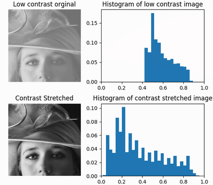
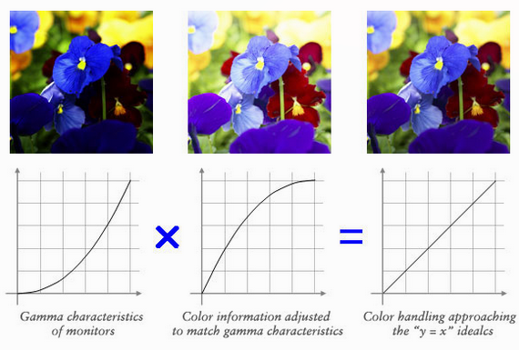

# Q9.  Histogram transformation.  Explain and exemplify the example of contrast stretching and gamma correction.  Where do we use these operations in practice?  
 
**Usage:**
On utilise le streching et la correction gamma quand l'histograme de l'image n'est pas uniforme (quand il ne couvre pas toute la rangée dynamique de l'image et qu'il y a de grand écards entre les valeurs).

**Contrast streching (explain contrast stretching):**
Le contrast stretching est utilisé  pour augmenter la rangé dynamique jusqu'au bord pour rendre l'histogramme plus large.
Le contraste streching ne crée pas vraiment de nouvelle valeurs:
Il rend plus visible pour l'oeil humain certains détails.

**Correction gamma (explain gamma correction):**
Le gamma caractérise le contraste d'un support de captation ou de diffusion d'images.
Il est utilisé par exemple pour corriger l'e rendu d'une image sur un autre support (autre écran, papier, mur, etc.).
C'est l'amplification non linéaire que l'on applique au signal électrique avant la transmission pour obtenir un rendu satisfaisant.
La correction de gamma peut se comprendre comme un moyen de transmettre sa luminosité perçue.

