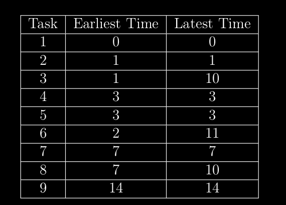
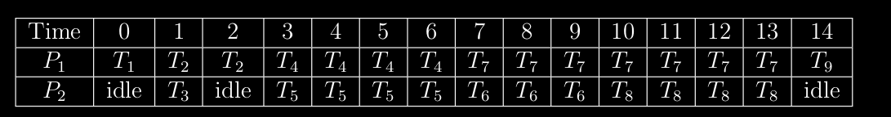

# 9._La_méthode_des_temps_au_plus_tôt_et_au_plus_tard.md
Sert à résoudre le problème du `placement` et de `l'ordonnancement` (ordonnancement statique surtout)

Permet `d'analyser le graphe des précédences` pour faire un placement et l'ordonnancement des tâches

On construit une table (au plus tôt et au plus tard par tâche) dans le processus d'analyse

On construit finalement une table de placmenet et d'ordonnancement pour déterminer le nombre de processus necéssaires.

# Présenter un exemple pratique

