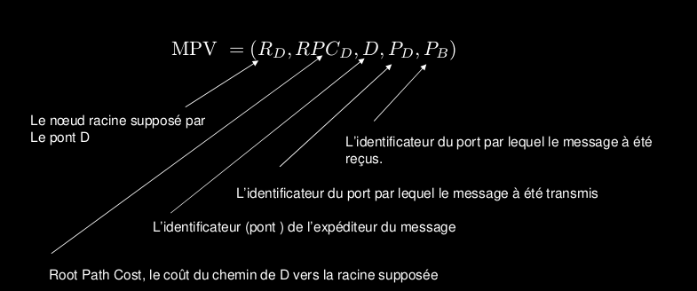
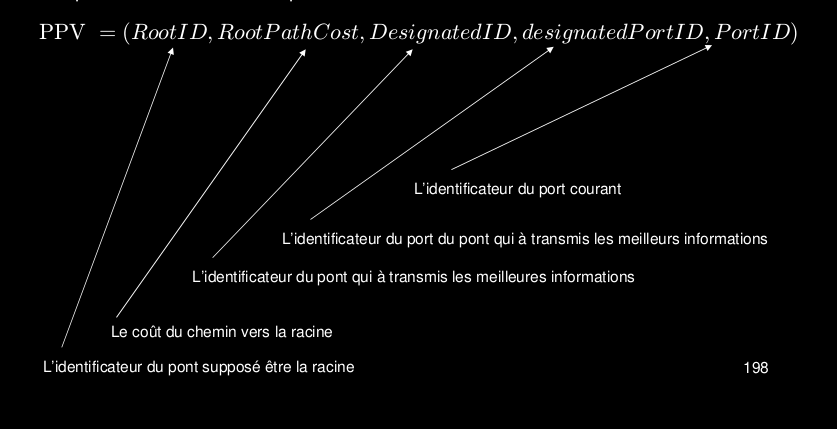

# Interconnexion des Réseaux de niveau 2

## Adresse MAC
Utiliser pour indique l'addresse de l'émetteur-récepteur

## Répéteur (couche 1)
concentrateur, génère signal électrique, augmente la distance de transmission d'un signal

## Hub (couche 1)
Interconnecte les appareils

## pont=bridge (couche 2)
Interconnecte les LANs (souvent de type différent) utillisent les adresses de trames pour router.
Peut filtrer:
	- si une trame transmise sur un port ou non
Peut réexpéditionner:
	- détermine l'interface de réception pour une trame grâce à une table qui contient:
	    - L'adresse LAN des stations
	    - L'interface de pont qui y conduit
	    - L'heure d'actualisation des données
Le pont fait de l'auto apprentissage sur la structure du réseaux

## commutatuers=switches (couche 2)
Comme les pont, mais on y connecte directement les ordinateurs
Plusieurs stations peuvent émettre en même temps
Dispose d'une table (mac, port)

## inondation=flooding
Si aucun déstinataire, transmet dans tout les ports (sauf port de réception)

## Snanning trie protocole (802.1D)
Algorithme qui doit générer un arbre de recouvrement (arbre=sans cycle, recouvrement=complet)
Les ponts doivent trouver la bonne topologie de manière indépenante (sans aide humaine)

## Structure de données
Les ponts communiquent en échangeant des BPDUs (Bridge protocol
Data Unit) comme les messages MPV (Message Priority Vector)

## Ports et priorité
A chacun des port est assigné un vecteur de priorité PPV (Port Priority Vector)
qui à la même structure que les MPVs.

## Adresses MAC
Il y a trois format d’adresses MAC
– MAC-48
– EUI-48 (Extended Unique identifier)
– EUI-64
Le câblage centralisé consiste à équiper chaque bureau d’une ou
plusieurs prises directement reliée à une armoire de câblage.
Les LAN virtuels (VLAN) ont été introduits pour permettre la division
logique du réseau facile et toujours possible. Les VLAN utilisent des
commutateurs spécialement conçus.
211
Chaque VLAN possède sa propre table d’adresse MAC
Le trafic broadcast émis au sein d’un VLAN est transmis par inondation
à chacun de ces membres
Le trafic broadcast n’est pas émis d’un VLAN vers un autre VLAN.
Le trafic unicast émis au sein d’un VLAN n’est pas acheminé vers un
autre VLAN
