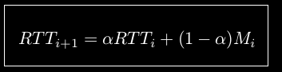
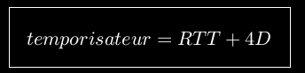

UDP-TCP jusqu'à la diapo 73 (et sans le détail des calculs des pages 70-72)

# Le modèle TCP/IP

# TCP
TCP(Transpor contrôl protocol)
Protocole fiable orienté connexion: achemine les données dans l'ordre dans le réseau
Protocole avec connexion (logique)

Etablissment de la connexion:
• Pour synchroniser la connexion l’hôte A active le bit S du champ
Flags du segment TCP transféré. Le champ séquence sert à
initialiser le compteur de séquence qui permet de remettre les
paquets dans le bon ordre.
• L’hôte B acquitte la tentative de connexion en répondant par un
segment TCP dans lequel les bits S et A du champ Flags sont
positionnés. Le serveur choisis aussi un numéro de séquence.
• L’hôte A envoie un segment avec le bit A du champ Flags
positionné pour acquitter le segment de B et la transmission des

Déconnexion comme la connexion

Il faut utiliser des sockets pour établir une connexion
Socket: adresse IP et numéro de port de l'hôte
Une fenêtre définit si l'emmetteur peut continuer à transmettre

L'algo de Nagle est utilisé lorque l'application génère des données octet par octets.
La solution de Clark consiste à empêcher les récepteur d'actualiser la fenêtre de réception pour un seule octet.

Fenêtre de congestion: utilisé par TCP pour une gestion dynamique du contrôle de flux. Permet à l'emetteur de limiter le nombre d'octets transmis s'il observer que le récepteur ne peut pas traiter les données à la vitesse indiquée par la fenêtre de transmission

# UDP
UDP (User datagram Protocol): non-fiable sans connexion ni contrôle de flux (utile pour la transmission de la parole)

threshold (=seuil d'évitement des congestions)

Si un paquet se perd, tout les autres sont enregistrés et on redemande le paquet manquant.
Fast recovery= à la réception de 3 accusés de réception avec le même numéro x l'émetteur retransmet le paquet x.

Round Trip Time
Le temporisateur de retransmission estime le temps de boucle, c’est-à-
dire le temps nécessaire au retour de l’acquittement

# Estimation de RTT
Le temps de boucle RTT n’est pas constant, en général il fluctue autour d’une
valeur moyenne (variable aléatoire)

Il existe aussi le temporisateur de persistance. 

Méthode d'évitement de congestion (suite)
On définit un feedback avec lequel on pourra faire des contrôles:
- distribués
- additifs
- multiplicatifs
- mixtes

On sélectionne ces contrôles selon 3 critères:
1. Efficacité
2. Equité (index d'équité)
3. Implémentation distribuée

On a démontré
Pour assurer que le mécanisme de contrôle de congestion
convergence vers une solution équitable et efficace, il faut:
– Les phases de décroissance doivent être multiplicative (pures)
– Les phases de croissances sont toujours additives avec un coefficients
positif et il peut a avoir un facteur multiplicatif pas plus petit que 1.
