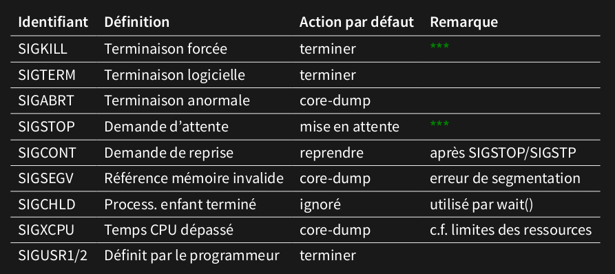

Signal:
événement asynchrone
numéro (constantes C définies)

envoyé quand:
signaler un événement
demande d'un autre processus (appel système)

Masquage des signaux:
Le signal arrête le processus pour faire exécuter une action.
On peut alors mettre le signal en attente en mettant un masque dessus. L'action ne s'exécute pas tant que le masque est présent.

La fonction sigaction(signum, act, oldact)
Lie au signal signum l'action act (et peut-être oldact)

Un handler doit pouvoir être interrompu à tout moment sans créer d'effet de bord (=ré-entrant), les fonctions qu'il invoquent doivent l'être aussi.
