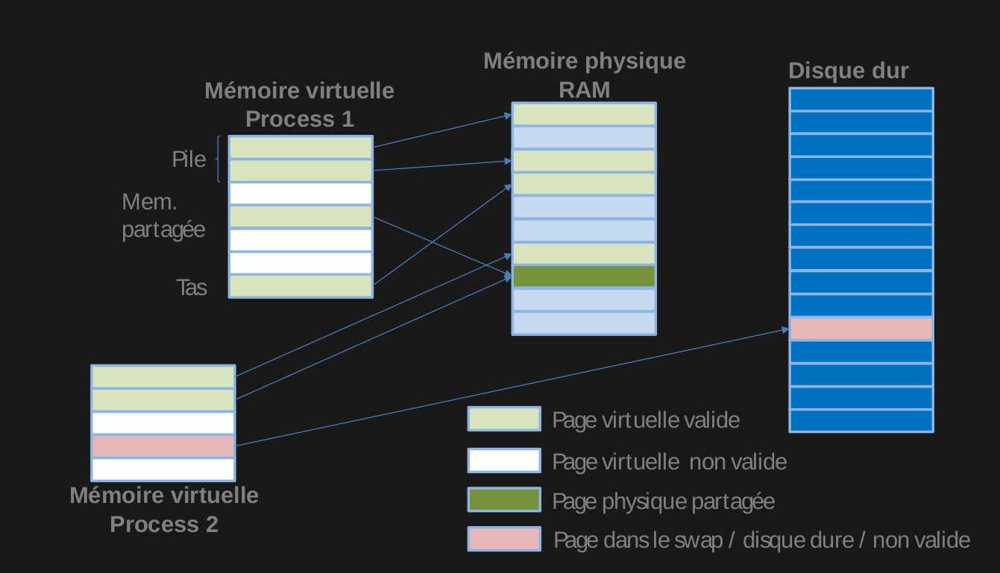

# Memory

## 1. A l’aide d’un schema expliquer la notion d’adressage virtuel et sa relation avec la mémoire physique.


## 2. Que fait le programme suivant ?
Il exécute un programme lourd (optionnellement sur la mémoire RAM)

## 3. A quoi sert l’entrée "install" du makefile ?
L'entrée install permet d'assurer que l'utilisateur exécute bien le programme en ayant les droits root.
On "install" les droits root. Sinon le programme ne marche pas.

## 4. Décrivez le code et son fonctionement en détail.
- création de variables
- activation du lock (si l'utilisateur le précise) 
- place disponible dans la RAM et droits au processus 
- écriture dans la mémoire du system
- affichage statistique

## 5. Qu’est q’un défaut de page mineur / majeur ?
Un défaut de page arrive quand la page demandé ne se trouve pas dans la table du processus.
Un défaut de page est mineur si la page se trouve en mémoire physique, majeur sinon.

## 6. Le programme effectue-t-il plus de défaut de page lorsque le paramètre "lock" est passé ou sans paramètre ?
Le programme fait moins de défaut de page si "lock" est passé en paramètre. En effet, il permet de réserver la mémoire maximale possible pour effectuer son exécution.

## 7. Dans un cas général pourquoi utiliser la fonction mlock ?
 La fonction mlock nous permet de nous assurer une certaine marge de performance. En effet, nos pages ne sont pas enregistré dans une mémoire secondaire comme le swap mais directement présent en mémoire physique, augmentant la vitesse d'accès et de calcul par conséquent.
 
```c 
//la structure rlimit

struct rlimit { 
	rlim_t rlim_cur; /* Soft limit */
	rlim_t rlim_max; /* Hard limit (ceiling for rlim_cur) */
}; 
```

```c 
// la structure rusage

    struct rusage {
    struct timeval  ru_utime;     /* user time used */
    struct timeval  ru_stime;     /* system time used */
    long            ru_maxrss;    /* maximum resident set size */
    long            ru_idrss;     /* integral resident set size */
    long            ru_minflt;    /* page faults not requiring physical 
				     I/O */
    long            ru_majflt;    /* page faults requiring physical I/O */
    long            ru_nswap;     /* swaps */
    long            ru_inblock;   /* block input operations */
    long            ru_oublock;   /* block output operations */
    long            ru_msgsnd;    /* messages sent */
    long            ru_msgrcv;    /* messages received */
    long            ru_nsignals;  /* signals received */
    long            ru_nvcsw;     /* voluntary context switches */
    long            ru_nivcsw;    /* involuntary context switches */
}
```
