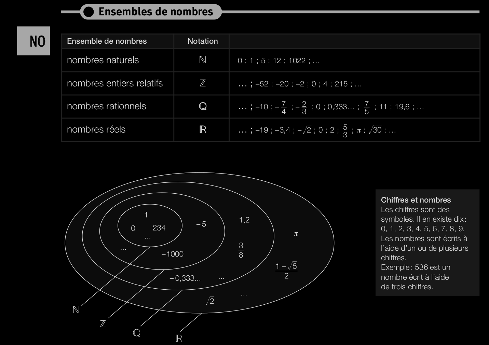
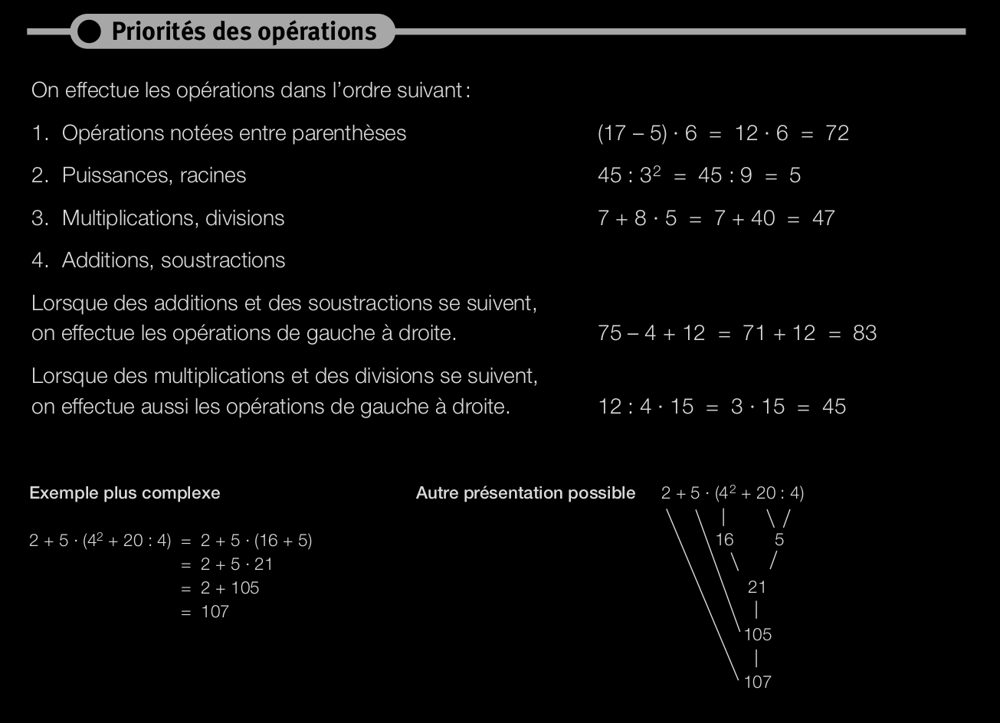
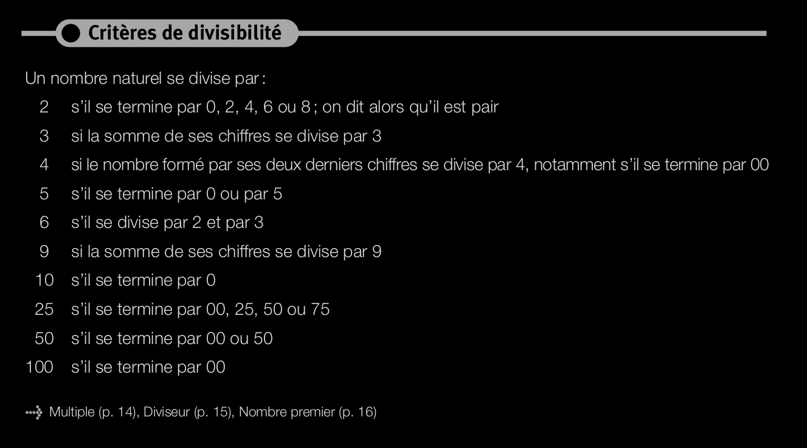
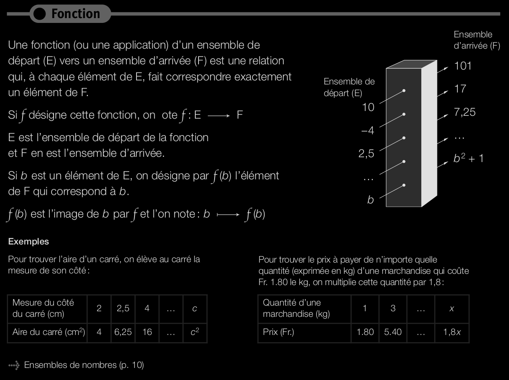
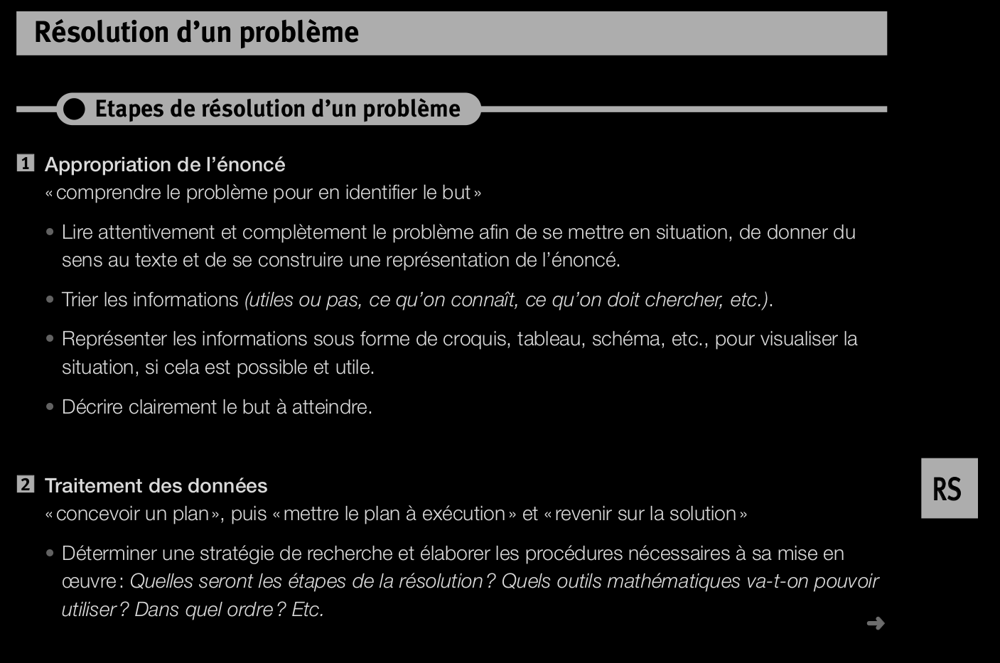
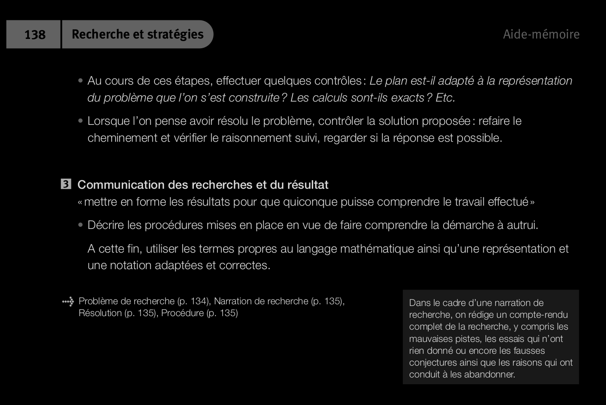

Aide mémoire 2011
==================

## Nombres et opérations
Ensembles

Notion d'ordre (croissant, décroissant)

opposé et inverse
distance valeur absolue et norme

multiplication nombre relatif
revoir nombre décimaux (p.25-28)

## Fonctions et algèbre

représentation d'une fonction (table de valeur, graphe, notation mathématique)
fonction constante
fonction linéaire
fonction affine
fonction quadratique
pente

calcul littérale (55-60)
identité remarquable
équation
résolution équation 1er degré
résolution équation  second degré
système d'équation

## Espace
skip

## Grandeurs et mesures
skip

## Recherche et stratégies

Multiplication de fraction -> décomposition en facteur premier -> nombre premier -> multiple et diviseur
