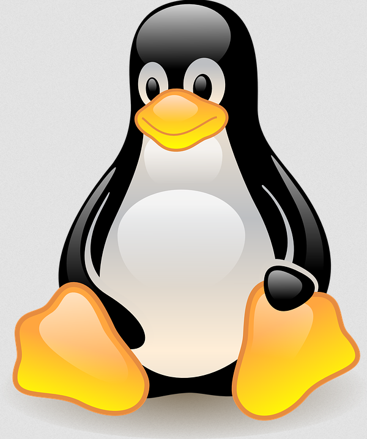
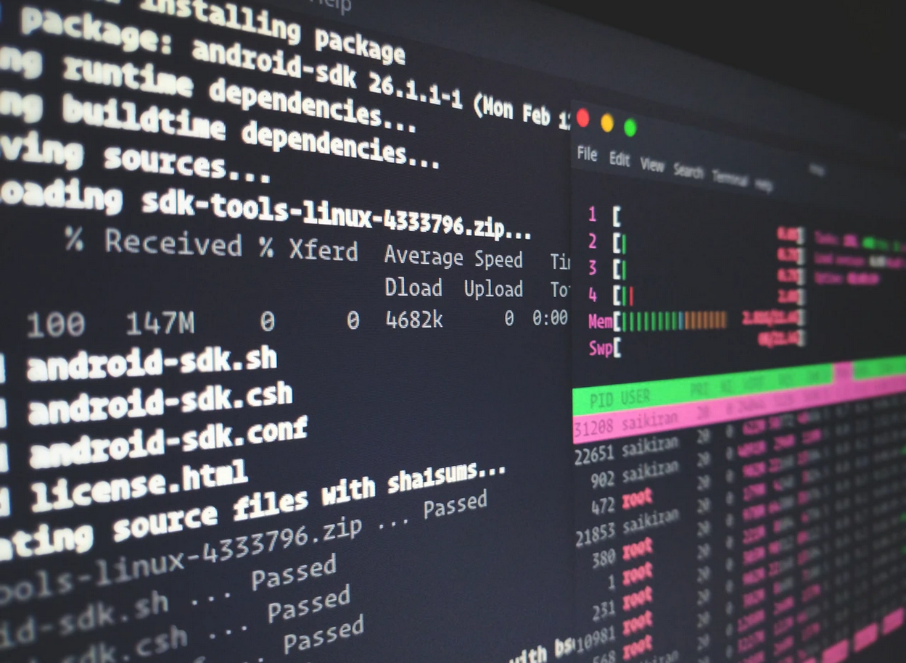
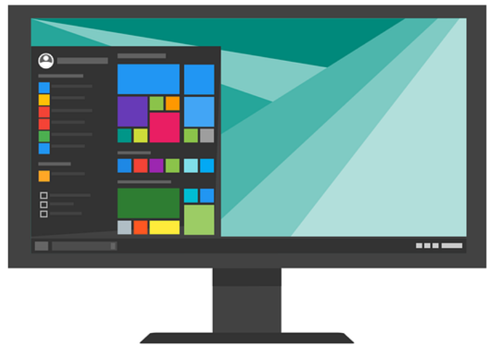
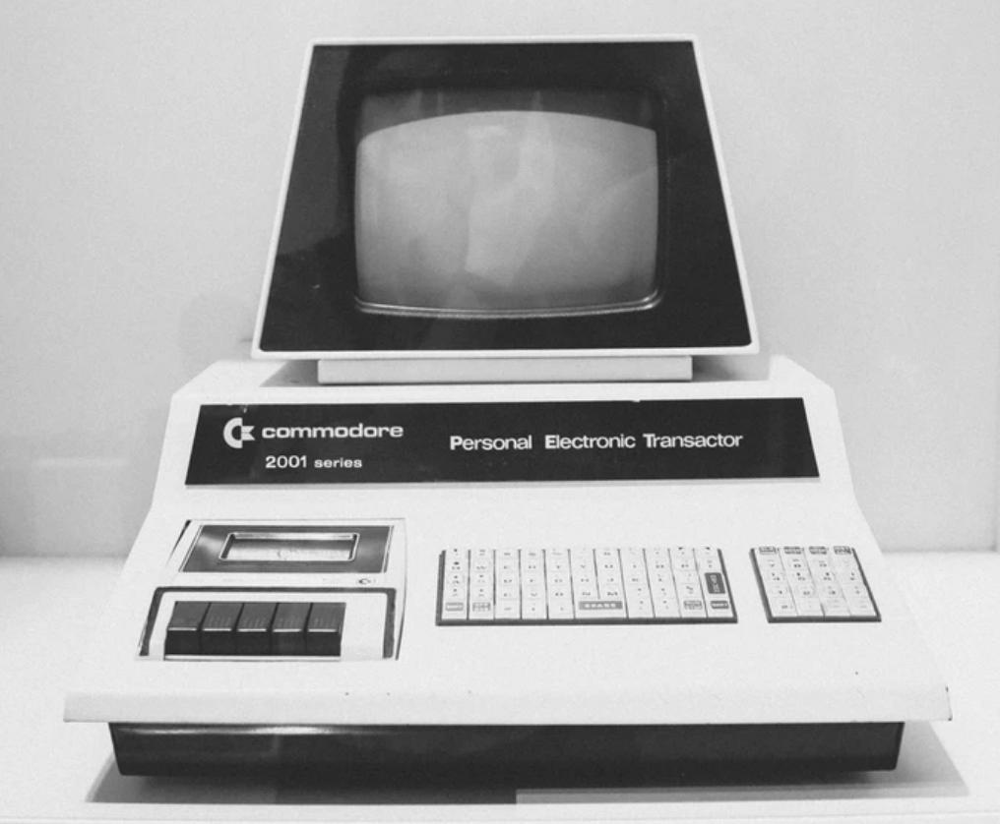
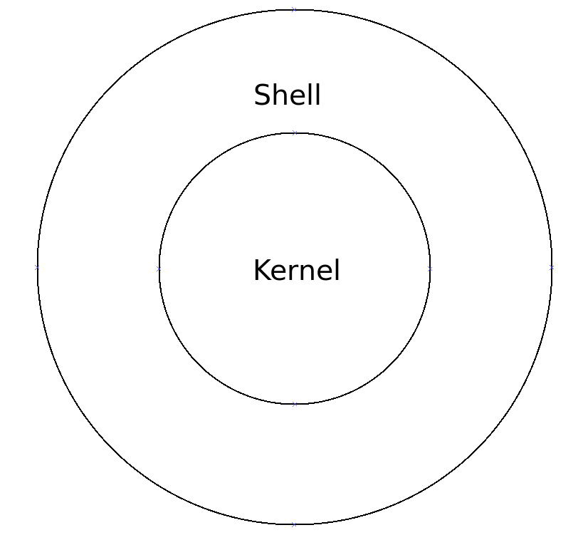
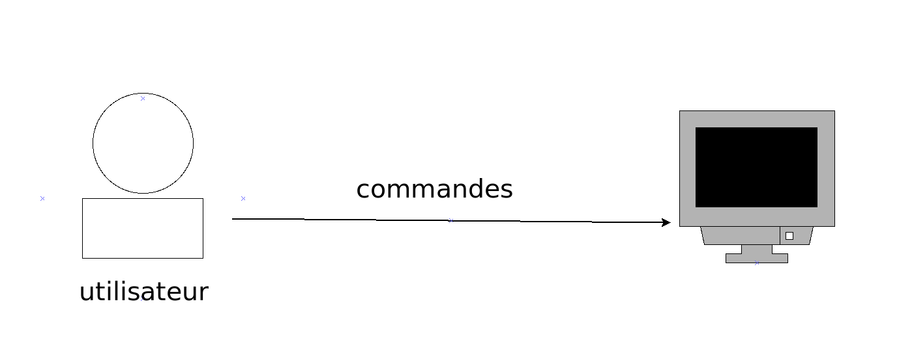

---

## CLI

---

## GUI

---

---

---

---

## principes

---

## Défauts

* accessibilité
* visuel

---

---

## Avantage

* plus de contrôle
* automatisation
* homogénéité

---

## Sommaire

* Commandes introduction
* Bash/scripting
* Logiciels cli

