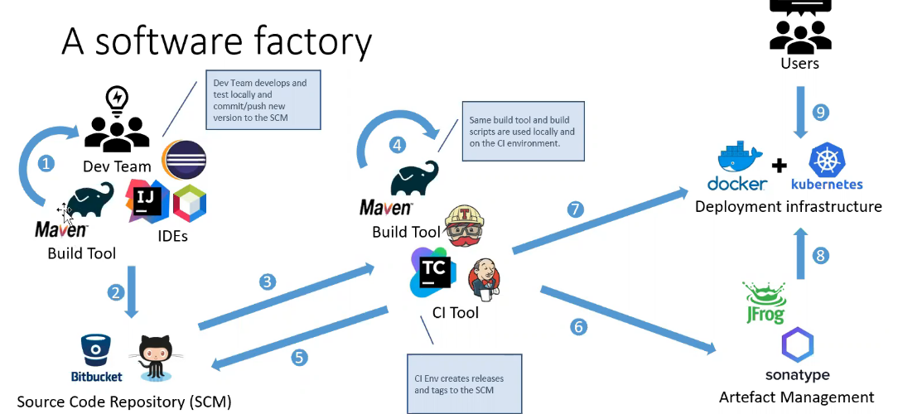

# Productivité
**Quelques règles à suivre pour rester productif**

1. don't do boring stuff => Automatiser les choses
2. don't trust your code => toujours faire des tests
3. be professional => utiliser le bon outil pour la bonne tâche
4. be lazy => ne pas réinventer un truc qui existe déjà
5. question yourself => toujours mesurer ce qu'on fait.
6. suivre un plan et s'y tenir

# Comment mesurer sa productivité?:
On utiliser des indicateurs (pas pour se comparer au autre) mais pour voir notre niveau d'avancement.

## Storypoints (vélocité)
Ce n'est pas une valeur absolue.  
Ça permet d'évaluer la quantité de travail.  
On peut évaluer les storypoints d'un projet grâce au scrum poker.  
On peut convertir cela en jour/homme si on veut.  

Le story point permet d'éviter des problèmes connus avec les jours/homme (mauvaise comparaison entre les personnes et les équipes).  

Quand on a trouvé les tâches et leur story point, on utilise un outils pour les répartir dans l'équipe.  
Après, haque matin, on fait un stand up:  
On regarde le Burndown Chart pour voir comment le projet avance.  

Vélocité (nombre de storypoints fait par jours) on compare la vélocité théorique (la ligne en bleu, toujours constante) et le travail vraiment fait (la ligne en vert qui peut changer).  
La vélocité théorique se crée après le premier sprint et après on ne la change plus.    
Le but c'est d'être le plus prévisible sur son travail. On veut éviter les surprises.    

Vocabulaire:
**Cycle Time metric**: temps pour régler un bug. Une feature est plus difficile à gérer.  

**Bug rates**: nombre de bug/nombre de feature  

# Usine logiciel 
C'est un peu une "usine" pour gérer notre projet depuis l'écriture du code jusqu'au deployement.  

Usine logiciel (software factory), 5 composants à retenir:  

- Build Tool (pour créer le code)
- Source code Repository (pour héberger le code ex.Git)
- Integration continu (CI)
- Artefact management (gère le code binaire ou le code compilé)
- Deployement infrastructure

## Build Tool
C'est pour écrire le code.  
Important utiliser une IDE et le maîtriser.  

## Source Code Management
C'est pour héberger le code  
merge Intégrer différent changement  
Branching strategy (stratégie à suivre pour être organisé):    

	- master (personne doit developper dessus) c'est pour les release.
	- Develop, sert à intégrer les branche
	- Feature, où chacun travail sur sa partie
	- Hotfix, où on fait des modifications courtes et rapides.

# Productivity Tips
- Automatiser ce qu'on peut
- Shell (apprendre un shell, bash, zsh, powershell, etc.)
- Éviter les mails (ça fait perdre du temps)
- Trouver l'environnement de travail (pour être concentré et efficace)
- Se connaître soi-même (connaître ses force et ses limites)
- Refactorer le code (sinon on le fait jamais)
- Avoir un bon environnement de test (sinon on le fait jamais)
