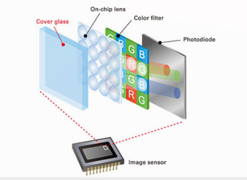
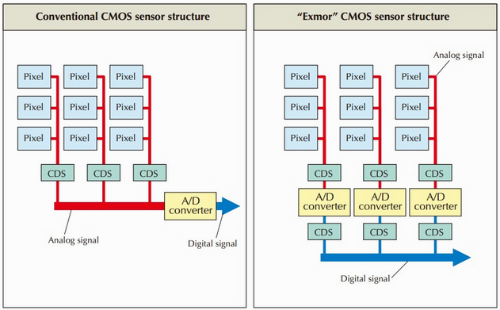

# Q6 Image acquisition. 
Q6. Image acquisition. Explain the design of modern sensors.

TODO
Composition en anglais

## Capteurs modernes (modern sensors)
**Composition**
Photocites:  
	puit à photon intensité lumineux  
Matrice:  
	philtre colographique attribut de la couleur aux pixels  
Microlentille:  
	converge les rayons au dans les photocyte  

[lien util][https://www.youtube.com/watch?v=eY4s1sVsiAM]

**Comparaison des capteur ccd et cmos**
Pour les deux capteurs, il y a une différence dans `le comptage des photons`.

`ccd:` Un système éléctrique pour les pixel. Stockés dans un puit de potentiel. Chaque électron est décalé pour enfin être compté par un ciruit électronique.
un seul circuit de comptage. Peut être optimisé facilement mais dépense beaucoup d'énergie pour le déplacement des charges est-ce ce que le prof a dit.   
Problème: pas toujours stable

`cmos`: un circuit de conversion par pixel. On a plus besoin de déplacer les charges pour le comptage

Détail final:
Le ccd a:

	- une surface photosensible plus grande

Le cmos a: 

	- un coup plus faible
	- une consomation électrique réduite
	- une vitesse de lecture plus élevée.

