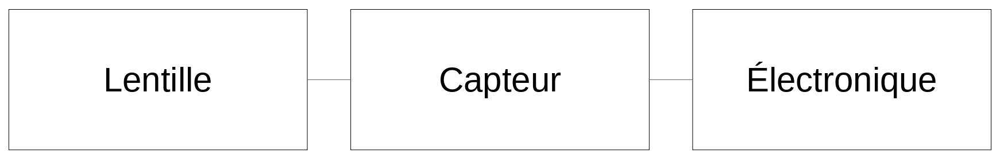

# Q21. Spatial filters.
Q21. Spatial filters: Explain the unsharpened mask and its link to the Laplacian sharpening.

**Masque flou (unsharpened mask):**
La photographie numérique a popularisé l'utilisation du masque flou pour accentuer les images, c'est-à-dire précisément pour améliorer leur piqué. Le principe de cette méthode avait néanmoins été imaginé dans le cadre de la photographie argentique. À la différence de la méthode de déconvolution qui implique des connaissances précises de la chaîne d'acquisition de l'image, cette méthode ne peut prétendre restituer, même partiellement, une information définitivement perdue. L'impression de netteté est améliorée par une augmentation du contraste d'une échelle de détails, ce qui peut conduire à l'ajout d'artéfacts si la correction est exagérée ou mal réglée.

Le filtre laplacien (laplacian filter) augmente la visibilité des bords.

Ces filtres sont pas mal similaire/proportionnels. On peut observer une similitude dans leur formule respective.

# Q5. Image acquisition
Q5. Image acquisition. Explain the role of a sensor in imaging. Explain the principle of photon counting? Which size of sensors is of preference in practice? Explain the trade-offs.  

**Définition**
C'est la partie matérielle des appareil de captures d'image (compose l'imaging pipeline)
Vient just après la lentille et avant la partie electronique.

**Son rôle:**
    Conversion de la lumière (photon) En courant électrique (electrons)

**comptage de photons (photons counting):**
Les photons sont capturés par la lentille et sont ammenés au capteur (sensor). Le capteur capture les photons dans des récepteurs qui vont les accumulé et les convertir grâce à l'effet photoélectrique (une propriété physique des photons qui permet d'arracher des éléctrons).
On appel gain quantique (quantum efficiency) le rapport de la quantité d'éléctrons créés par rapport à la quantité de photon reçu (car ces deux valeurs sont proportionnelles)
La qualité du comptage dépend de la taille et de la sensibilité du capteur.
puit_a_photon

**Compromis (trade-off)**
Dans l'actualité, on cherche beaucoup a miniaturiser les appareils pour des question de place, mais cela permet aussi d'augmenter la résolution (on a plus de pixel par surface). Le problème qu'on rencontre concerne le comptage des photons. En effet, si le capteur d'une cellule est petit, il attrappe moins de photon et ça diminue la qualité de l'image.
rapport taille photons

**Notions:**
gain quantique: rapport photon/électron
full well: quantité max d'électron recevable
effet photoélectrique: les photons arrache des éléctrons à chaque élément actif
# Q6 Image acquisition. 
Q6. Image acquisition. Explain the design of modern sensors.

## Capteurs modernes (modern sensors)
**Composition**
Photocites:
	puit à photon intensité lumineux
Matrice:
	philtre colographique attribut de la couleur aux pixels
Microlentille:
	converge les rayons au dans les photocyte

[lien util][https://www.youtube.com/watch?v=eY4s1sVsiAM]

**Comparaison des capteur ccd et cmos**
Pour les deux capteurs, il y a une différence dans le comptage des photons.

ccd: Un système éléctrique pour les pixel. Stockés dans un puit de potentiel. Chaque électron est décalé pour enfin être compté par un ciruit électronique.
un seul circuit de comptage. Peut être optimisé facilement mais dépense beaucoup d'énergie pour le déplacement des charges est-ce ce que le prof a dit. Problème: pas toujours stable

cmos: un circuit de conversion par pixel. On a plus besoin de déplacer les charges pour le comptage

Image05 ccd cmos

Le ccd a une surface photosensible plus grande
Le cmos a un coup plus faible et une consomation électrique réduite et une vitesse de lecture plus élevée.

# Q7  Image acquisition.
Q7. Image acquisition. Explain the different types of noise in digital images. How can one reduce the noise in digital images?

**Type de bruit (type of noise):**
Bruit thermique (thermal noise): Vient de l'agitation des électrons lorsqu'ils sont influencé par la température du capteur (plus c'est chaud, plus ils sont agités). Cela libère plus d'électron que prévu et peut créer des différences. Ce bruit est aussi appelé courant d'obscurité (=dark current)

Bruit de grenaille (shot noise): Arrive quand la quantité de photon ou électron est tellement faible que de petites fluctuation font de grande différence dans une images.
Bruit de quantification (quantization noise): Arrive lorsque on extrait des valeurs d'un signal continue (transmit par le photosite) dans un ensemble de valeur finit (pour avoir une taille d'image raisonnable). Comme la transformation des valeur est "arrondie", il y a une erreur entre la vrai valeur et la valeur quantifiée. La répartition de l'erreur suit une loi uniforme.

Bruit périodique (pattern noise): arrive quand un composant électronique produit une erreur constante dans la manipulation de l'image.

**Différentes solutions**
Pour réduire le bruit dans une image, on utilise souvent des méthodes pour diminuer les écards entre les pixels d'une image. C'est principalement des méthodes pour rendre l'image plus flou.
Quelque methodes:
1. downsampling NN: on échantillone assez de pixel pour garder la qualité visuel de l'image (qu'on regarde à l'oeil nu) tout en réduisant la quantité de bruit.
2. frame averaging (pour que ça marche, il faut plusieur fois la même image/scene et être sûr qu'on a le même bruit au même endroit sur les images)
3. denoising methods (single frame) des techniques moderne comme BM3D ou CNN
4. trained mappers en mappant des image moins claire dans des images de haute qualité.

# Q8 Image acquisition. 
Q8. Image acquisition. Explain the principles of modern color imaging. What is a color filter array? What is the demosaicing?

Color imaging

**Matrice de filtre colorés:**
Un capteur ne fait que de récolter les photons pour les attribuer à des pixel. Ce n'est seulement qu'une information d'intensité. On utilise des philtre coloré pour donner de la couleur. ils sont placés sur les photosites d'un capteur photographique pour permettre la sépartion des couleurs. Chaque pixel reçoit une couleur (cela dépend du philtre, comme Bayer, RGBE, etc) On crée finallement les caneaux de couleur en interpolant.

**Dématriçage (demosaicing):**
Est une des phases du traitement du signal brut issu du capteur d'un appareil photographique numérique. Il consiste à interpoler les données de chacun des photosites monochromes rouge, vert et bleu composant le capteur électronique pour obtenir une valeur trichrome pour chaque pixel. 
Action de base du traitement d'image.

# Q9 Histogram transformation. 
Q9. Histogram transformation. Explain and exemplify the example of contrast stretching and gamma correction. Where do we use these operations in practice?
 
**Usage:**
On utilise le streching et la correction gamma quand l'histograme de l'image n'est pas uniforme (quand il ne couvre pas toute la rangée dynamique de l'image et qu'il y a de grand écards entre les valeurs).

**Contrast streching:**
Le contrast stretching est utilisé  pour augmenter la rangé dynamique jusqu'au bord pour rendre l'histogramme plus large.

**Correction gamma:**
le gamma caractérise le contraste d'un support de captation ou de diffusion d'images.
C'est l'amplification non linéaire que l'on applique au signal électrique avant la transmission pour obtenir un rendu satisfaisant5. Cet ajustement volontaire de la caractéristique du signal n'a pas de rapport nécessaire avec le précédent. Même si les transducteurs sont linéaires, le bruit de fond est moins visible avec un encodage non-linéaire. La correction de gamma peut se comprendre comme un moyen de transmettre non pas la luminance d'un objet, mais sa luminosité perçue.

**notion**
Luminance: une grandeur correspondant à la sensation visuelle de luminosité d'une surface. 
