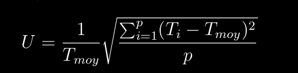
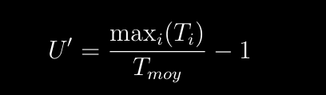
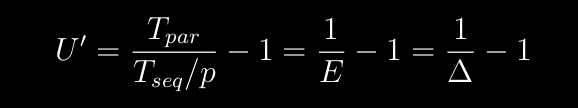

 # L'équilibrage de charge
 
 # présenter la problématique et les solutions
 un déséquilibre des charge interprocesseur entraîne une perte d'efficacité
 Speedup: degré de parallélisme moyen
degré de parallélisme inversément proportionnel au tôt de de déséquilibre de charge?

Trouver méthode pr:
	- partitionner le domain de calcul
	- réallouer les parts du domain de calcul

efficacité E (%): mesure de l'équilibre des charges, taux des processus qui travaillent effectivement

Tseq= temps exécution séquentiel du programme
Tseq/p= temps exécution parallèle du programme
Tpar= temps exécution parallèle  du programme

E= Tseq/(p*Tpar)

U= mesure du déséquillibre des charges

U=0 équilibrage parfait

# Voir aussi étude de cas statique et dynamique 
