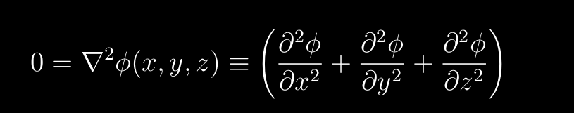
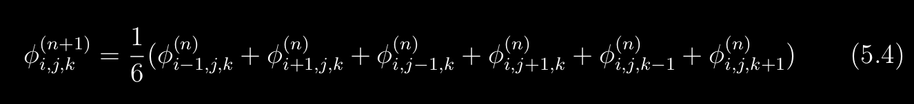

# 15 _Modèle_de_performance_pour_l_équation_de_Laplace
Problème général de communications locales.
Solution de l'équation de laplace

sur N^3 nous avons comme solution

On divise le domaine D en p morceaux de taille l (donc l^3 éléments)
donc N^3=p*l^3
Pour chaque grille il faut 6 opérations en virgule flottante par ittération, donc:
T_cal= (6*l^3)/R
Comme on a des cubes pour communiqué, il nous faudra 6*l^2 communications (en comptant les 6 face de l^2)
Le temps de transfère de ces données est donc:
T_comm= 6*(l^2)*C

T_parallel= T_cal+T_comm
Le rapport temps de communication et de calcul vaut:
T_comm/T_cal= (R*C)/l
le rapport devient petit quand le problème devient grand
Speedup S: S= T_cal/(T_comm+T_cal)

