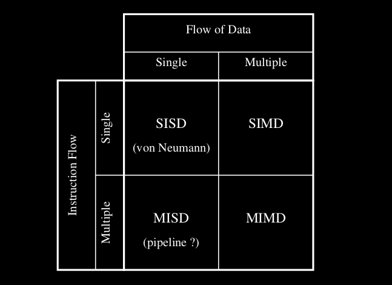

 
 Classification de Flynn (des architectures parallèles)
 
 
 SISD (Single Instruction flow, Single Data flow)
 SIMD (Single Instruction flow, Multiple Data flow)
 MIMD (Multiple Instruction flow, Multiple Data flow)
 MISD (Multiple Instruction flow, Single Data flow)
 
`Architectures parallèles:`

# à regarder plus tard
 SIMD
Deprecated
Les progrès technologiques permettent aujourd’hui de construire des machines MIMD avec: 
- souplesse++
- adaptées++ applications

Mais, efficaces dans certains problèmes (par exemple de traitement d’images ou du signal).
Ainsi, certaines parties des processeurs modernes et des cartes graphiques fonctionnent sur le principe SIMD afin d’optimiser certains calculs répétitifs.

MIMD
 Un ordinateur MIMD (Multiple Instruction Multiple Data):
processeurs communication efficace propre flot d'Instruction données possiblement différentes. (variété d'instruction)
Asynchrone => non déterministe car deux exec du même programme possiblement différent
Il y a deux principales: 
	- mémoire partagée
	- mémoire distribuée
	- aussi mémoir partagée virtuelle (NUMA et COMA) (cherche avantage des précédents: scalabilité et simplicité)
 
`Ordinateurs vectoriels:`
Populaire avant les machine parallèles.
Très puissant dans le calcule scientifique. Technologie de pointe, prix élevé

Un exemple célèbre d’une telle architecture est le Cray Y-MP qui combine le côté vectoriel avec la présence de plusieurs
processeurs (habituellement utilisés pour augmenter le throughput du système
plutôt que pour faire du parallélisme au niveau d’un même programme)

Dans le même esprit, le Cray C-90 et le NEC SX-4 sont d’autres exemples récents
d’architectures vectorielles multiprocesseurs.

# chercher plus d'info sur le vectoriel

`Parallélisme aut niveau des instructions`
ILP
 
Data-flow
Normalement c'est contrôl-driven (Von Neumann).
Il existe aussi le data-driven et demand-driven (machine à réduction)
Les données ont un rôle important.
Dans l’architecture data-driven, c’est la disponibilité des données qui dé-
clenche les instructions correspondantes. 
Ainsi, l’instruction
a = b + c
sera exécutée dès que les valeurs de b et c seront calculées.
Ensuite, ce résultat est duplifié autant que nécessaire pour toutes les autres intructions qui en ont besoin.

pas de compteur d’instruction, et ordre d'écriture pas forcément respecté.
représentation par une structure en arbre. Visualisation ascendante.

Le parallelisme se fait naturellement.
