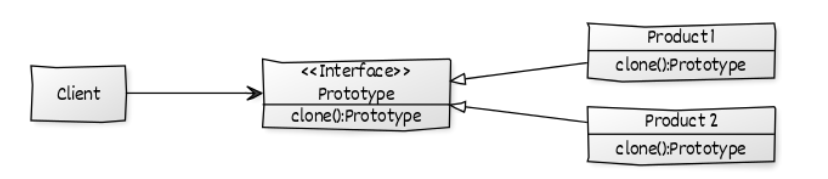

# Prototype

Creational pattern



## Définition
Le but est de créer un objet par défaut et de le cloner lorsqu'on demande une nouvelle instance.
Le clone peut modifier des élément de l'objet original.

## Composition:
- Product : L'objet en question
- Prototype: registre pour avoir accès à tout les propotypes.
- Client : Utilisera le registre pour gérer les prototype.

## Exemple:
On a mit deux couleurs dans ColorStore par défaut (bleu et noir)


## Définitions	
| classe     | rôle           | description                    |
|------------|----------------|--------------------------------|
| Prototype  | Prototype      | retourne les instances         |
| Color      | AbstractObject | Clonable                       |
| blackColor | Product        | géré par l'interface Prototype |
| blueColor  | Product        | géré par l'interface Prototype |
| ColorStore | Client         | Demande différentes couleurs   |


## Pseudocode
main() 
    ColorStore.getColor("blue").addColor(); 
    ColorStore.getColor("black").addColor(); 
    ColorStore.getColor("black").addColor(); 
    ColorStore.getColor("blue").addColor(); 

## Code
```java

// A Java program to demonstrate working of 
// Prototype Design Pattern with example 
// of a ColorStore class to store existing objects. 

// Driver class 
class Prototype 
{ 
	public static void main (String[] args) 
	{ 
		ColorStore.getColor("blue").addColor(); 
		ColorStore.getColor("black").addColor(); 
		ColorStore.getColor("black").addColor(); 
		ColorStore.getColor("blue").addColor(); 
	} 
} 

import java.util.HashMap; 
import java.util.Map; 


abstract class Color implements Cloneable 
{ 
	
	protected String colorName; 
	
	abstract void addColor(); 
	
	public Object clone() 
	{ 
		Object clone = null; 
		try
		{ 
			clone = super.clone(); 
		} 
		catch (CloneNotSupportedException e) 
		{ 
			e.printStackTrace(); 
		} 
		return clone; 
	} 
} 

class blueColor extends Color 
{ 
	public blueColor() 
	{ 
		this.colorName = "blue"; 
	} 

	@Override
	void addColor() 
	{ 
		System.out.println("Blue color added"); 
	} 
	
} 

class blackColor extends Color{ 

	public blackColor() 
	{ 
		this.colorName = "black"; 
	} 

	@Override
	void addColor() 
	{ 
		System.out.println("Black color added"); 
	} 
} 

class ColorStore { 

	private static Map<String, Color> colorMap = new HashMap<String, Color>(); 
	
	static
	{ 
		colorMap.put("blue", new blueColor()); 
		colorMap.put("black", new blackColor()); 
	} 
	
	public static Color getColor(String colorName) 
	{ 
		return (Color) colorMap.get(colorName).clone(); 
	} 
} 

```
