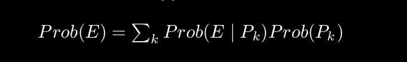
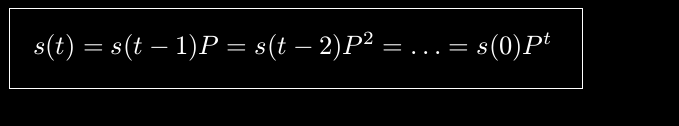
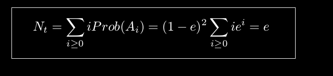
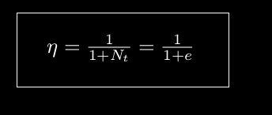
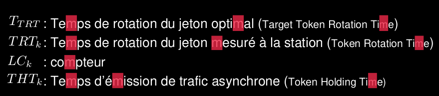
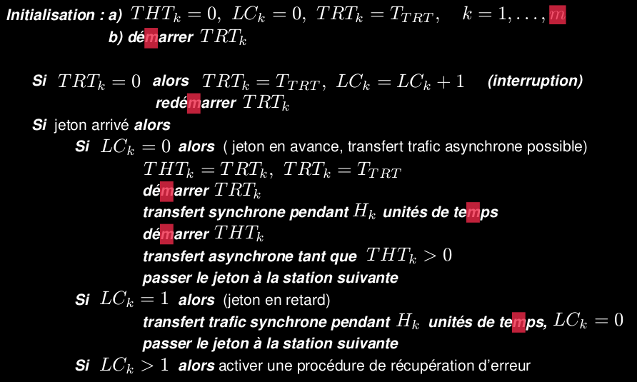

le champ de l'examen est le fichier Cours jusqu'à la diapo 265 et sauf les diapos 246-251.
IP jusqu'à la diapo 92
UDP-TCP jusqu'à la diapo 73 (et sans le détail des calculs des pages 70-72)

# Plan
On a vu les modèles de chaînes de Markov homogènes et l’analyse du
régime stationnaire.
- Chaîne de Markov homogènes
- Analyse du régime stationnaire
- Analyse de performance de protocole en régime stationnaire
- Protocoles MAC pour l'accès au canal de transmission:
    - Protocole à accès aléatoire (Aloha)
    - Protocole CSMA/CD (Ethernet)
    - Protocole CSMA/CA (802.11)
    - Protocole à partage de ressources (token)
On a vu le principe des codes convolutifs et le décodage de Viterbi.

[chaine_de_markov](chaine_de_markov)

## Couche physique:
La couche physique:
est responsable de transmettre ‘physiquement’ l’information d’une station à une autre. La nature des signaux et du média de communication doivent être définis.

- Signaux électriques, tensions appliquées
- Signaux optiques, longueur d’ondes
Cette couche est responsable de la transmission d’une suite de 0 et
de 1, sans format, sous la forme d’un flot de données.

## Couche de liason de données
- La couche liaison de données – link layer (LL):
fiabilise les transmissions de la couche physique.
- gère les erreurs de transmission
- Structure le flot de données en trame de données (de 100 à 1000 octets).
- Introduit différents types de trames – contrôles et données – en particulier les trames d’acquittement qui permettent de vérifier que les données ont bien été reçues.
- Corrige les erreurs – trames perdues ou transmission.

## Protocol ARQ
Les protocoles ARQ (Automatic-Repeat_Request) sont destinés à corriger les erreurs de transmissions en répétant les messages non acquités. Ces protocoles sont implémentés dans les couches liaisons de données (et transport - TCP).

1. Stop-and-Wait ARQ
2. Go-Back-N ARQ
3. Selective-Repeat ARQ

## Trame
En-tête | Données | CRC

## 1. Stop-and-Wait ARQ
émetteur procède selon les étapes suivantes:
1. transmet une trame
2. déclenche un temporisateur et attend un acquittement
3. si un acquittement positif est reçu, transmet la trame suivante
4. si un acquittement négatif ou que le temporisateur expire,
retransmet la trame.
5. goto 1.

## 2. Go-Back-N ARQ
Avec le protocole Go-Back-N, l’émetteur transmet les trames et mémorise les trames localement jusqu’à réception de l’acquittement.
Le nombre de trames dans le tampons d’émission s’appelle la fenêtre de transmission, noté N. N est le nombre de trames transmises pendant un intervalle RTT.
Le récepteur vérifie que les trames reçues sont correctes. Si oui, il transmet un acquittement positif (ACK) pour chaque trame séparément.
Lorsque l’émetteur reçoit l’acquittement il supprime la trame correspondante de son tampon d’émission.
Si erreur: aquitement négatif

## 3. Selective Repeat ARQ (SR ARQ)
Le protocole SR ARQ améliore le protocole Go-Back-N. Avec ce protocole, l’émetteur ne retransmet que les trames négativement acquitées.

## Stop-and-wait avec automate
Mesure de performance
Probabillité de transmission d'une trame
e= 1- (1-epsilon)^n=~epsilon*n
L'état d'un émetteur est un vecteur donnant le résultat des trames envoyé selon un temps t
Au temps t=0
s(0)= (1 0 0 ...)
s(1)=(1-e e 0 ...)

En définissant une bonne matrice, on peut alors définir l'état d'un système selon cette formule.

Lorsque le temps devient grand le comportement de l’émetteur tend vers un comportement stationnaire (ne change pas en probabilité avec le temps). En effet, soit s(0) n’importe quel vecteur de probabilité.
Donc P^infini est la limite quand t temps vers l'infini.
P^infini=(1-e)(1 e e^2 e^3 ...)
Mesure de performance (=nombre moyen de retransmissions): 
La probabilité que l'émetteur soit dans un état Ai est de:
Prob(Ai)=(P_i)^infini*(1-e)
Le nombre moyen de transmission Nt:

efficacité du canal (inverse du nombre total de transmission par trame)

La probabilité invariante p ∞
i s’interprète comme le nombre de
d’intervalles de temps que l’émetteur passe dans l’état i. Si la
transmission d’une trame dure x secondes, le temps moyen est xp ∞

Le temps de boucle RTT (Round-Trip-Time) est le temps qui s’écoule entre le
moment ou un paquet est émis jusqu’à la réception de l’acquittement.

## Réseaux locaux
On peu avoir un réseau d'interconnexion avec les deux premières couches

## Réseaux LAN
réseau privés, faible distance de communication
(unis, centre de recherche, banque, etc.)

VERSUS
On parle de liaison à diffusion (câble, ou sans fil) lorsque on a plusieurs appareils pour un média de communication (collision=supperposition de signal).
Peut aussi être une liaison point-à-point lorsqu'on une communication entre deux appareil seulement.
Exemple (PPP, HDLC)

## Aloha
Protocole à diffusion et a accès aléatoires
Structure du réseau en hub
deux fréquences distinctes:
1. de Ohau à tous
2. de tous à Ohau

Collision si plusieurs stations transmettent en même temps.

## Algo Aloha:
Lorsqu’une trame est soumise à la couche liaison de données d’une station,
1. La station attend un temps aléatoire avec un distribution exponentielle (loi sans mémoire):
    1. Le temps d'attente est invariant qu'on attende depuis longtemps
2. La station transmet la trame
3. La station attend un temps fixe. Si un acquittement positif est reçu d’Ohau
pendant l’attente la transmission est finie, sinon retour au point 1 (retransmission).
Le protocole exécuté par Ohau est
1. Attendre une trame
2. Si la trame est reçue correctement transmettre un acquittement positif.
3. Retour en 1.

Suit une loi exponnentielle
Interval [0,t]
Sous intervalles de taille 1/n
Variable de Bernoulli= lambda/n=>1 sinon =>0

## Mesure des performances Aloha:
througput= nb trames/secondes
Sloted Aloha, le temps est divisé en slot (interval de temps). Ainsi les appareil continue à transmettre aléatoirement leur données indépendament les une des autres mais doivent envoyé que sur un slot de temps défini.
On divise par deux la fenêtre de visibilité

Processus de poisson d'intensité G
G= nb trames/unité de temps
Il ne doit pas y avoir d'autre transmission que dans la fenêtre de visibilité.
fenêtre de vulnérabilité= deux fois la duré de la trame= 2T
S-G*exp(-2G)
S-G*exp(-G)

exp(...)= pas de colision
S= débit effectif
## Ethernet (802.3)
Réseau à diffusion
Transmission en bande de base: Sans modulation de signal
Connecté par des câbles coaxiaux:
	- épais (10Base5)
	- fin (10Base2)
	- paires torsadées (10BaseT) (Topologie en étoile)

Un tranceiver (transmitter – Receiver) permet de connecter l’interface
Ethernet au media de communication (câble coaxial, paire torsadée).
L’intérêt d’utiliser un tranceiver est que l’interface Ethernet est
indépendant du média

Fonctions du tranceiver
1. Transmission de données en bande de base
2. Réception de données
3. Détection de collisions
4. Surveillance fonctionnelle, inhibe la fonction d’émission
5. Possibilité d’interrompre les transmissions si collisions, ou si les
données sont excessivement longues. Cette fonction permet
d’isoler automatiquement une station défaillante.

## Trame Ethernet
Préambule||destination|source| |données|PaD|CRC
PAD= 64bits (assez longtemps transféré pour repérer les collisions)
Pour augmenter le débit, on doit augmenter la taille des trames.

## Algo Ethernet
- À la réception d’une trame à transmettre la couche liaison de
donnée teste si le canal est occupé.
- Si non, attend que le canal ne soit plus occupé.
- Si oui, transmet la trame.
- Pendant la transmission l’adaptateur observe qu’une autre station
ne transmette pas en même temps (collision).
- Si une collision survient, l’émetteur cesse la transmission et
recommence.
- Sinon, la trame est transmise.

Gestion des collisions grâce à une phase d'attente exponentielle
Plus on collisionne, plus on augmente le temps d'attente (car ça veut dire qu'il y a plus d'utilisateurs que prévu)
Quand la trame basse tout le monde le sait (broad cast) et laisse assez de temps pour que le récepteur envoie l'acquittement.
CSMA/CD= Carried Sense Multiple Access Collision Detection

## Analyse de performance Ethernet
Pour k stations, la probabilité A qu'une station émette sans collisione est:
A=kp(1-p)^(k-1)

Probabilité que le nombre de slots de contention soit j , c’est-à-dire le
nombre de slots total avant émission correcte d’une trame:
A(1-A)^(j-1)
L'efficacité moyenne du canal (P est la durée d'émission d'une trame):
P/(P+((2*tau)/A))
P=F/B	=> la longeur F des trame, le débit B
tau=L/c => longueur L du segment, vitesse c de propagation du signal
A= 1/e 	=> Optimal

## Protocole à jetons
Comparée à Aloha et Ethernet, assure un débit minimal aux stations (pad d'application temps réel car temps de réponse borné)
Offre une garantie de crédit.
La trame jeton est transmise de station en station (cycle). Chaque station à l'addresse de son successeur. Chque station aura une période de transmition bornée à H_k secondes.
T_TRT est le temps de rotation du jeton qui assure une débit de H_k*B/T_TRT [bits/sec] si B [bits/sec] est le débit du canal.
Demande un réseau en anneau
Nous avons un timer TRT_k et un compteur LC_k

## Algo Protocole a jeton

## Réseaux radio 802.11
**Contraintes caractéristiques**
1.
2.
3.
4.
5.
Une atténuation rapide, difficilement prédictible et dépendant de
la position des stations des signaux transmis. Technique de
codage et recouvrement des erreurs plus élaborées quand celles
utilisées pour les réseaux câblés.
Limitation quand à la puissance des signaux émis (législation,
technique)
L’énergie est souvent une ressource critique pour les utilisateurs
des réseaux sans fil. En effet, ces réseaux sont souvent associés
à des stations mobiles et alimentées par batterie.
Plus difficile d’assurer la sécurité des transmissions, le medium
de transmission est facile à espionner.
La mobilité des stations implique que la topologie des réseaux de
communications change avec le temps.
90
## Ad Hoc
En Mode Ad Hoc (Independent/Ad Hoc Base Service Set) le réseau est
composé de stations qui communiquent sans relais.
Les stations sont capables de se ‘reconnaître’ et d’établir des
connexions point-à-point (peer-to-peer), c’est-à-dire que pour
communiquer deux stations doivent se trouver dans le rayon de
communication de l’autre.
IBSS : Independent

## Mode infrastructure
Le mode Infrastructure est le mode généralement mis en œuvre et
permet l’interconnexion d’un réseau sans fil avec un réseau cablé
conventionnel en utilisant un élément dédié appelé Acces Point (AP).
Les Acces point sont utilisés pour faire transiter l’information entre
 L’élément qui permet de connecter un point d’accès (AP) à un réseau
qui n’est pas du type IEEE 802.11 s’appelle un portail (portal).
différents BSS par une entité appelée Distribution system (DS).
L’ensemble s’appelle Extended Service System (ESS).

## La couche d'accès au canal MAC
Le protocole de base est du type CSMA utilisé pour les transmission de

## RTS/CTS
Se fait lorsqu'il y a des stations cachées.
La norme 802.11 paque de contrôle pour attribuer le canal de trnsission à un émetteur
Un émetteur commence par émettre un petit paquet RTS (Request To
Send) pour annoncer qu’il désire émettre. La taille du paquet est petite
pour limiter les collisions.
Le récepteur émet un CTS (Clear To Send) à une station pour lui
signifier qu’elle peut utiliser le canal. Le paquet CTS est diffusé à toutes
les stations qui considère le canal comme occupé.
type unicast. Un temps d’attente aléatoire est tiré avant chaque
transmission.
– Une station attend que le canal soit libre avant d’émettre
- Si le canal est occupé la station attend – sans décrémenter le
temps d’attente.
– Lorsque le canal est libre et le délai d’attente aléatoire écoulé la station
émet une trame (frame).
– La station réceptrice acquitte le transfert immédiatement.
– Si la trame n’est pas acquittée la station ré-exécute le protocole.
- le temps pendant lequel le canal est occupé n’est compté dans le
délai d’attente.
- Le délai d’attente maximum est doublé chaque fois qu’un paquet est
perdu.

## RTS/CTS NAV
Les paquets RTS, CTS et Données contiennent des informations sur la
durée des émissions.
Ce mécanisme permet à une station de connaître l’état du canal
(occupé) même si elle ne reçoit pas de données (le canal est perçu
comme étant libre).
Chaque station maintient cette information dans une structure appelée
Network Allocation Vector (NAV).
Ce mécanisme est un mécanisme de détection de porteuse virtuelle
(virtual carrier detection).

## Mode PCF centralisé
La norme 802.11 prévoit la possibilité de faire transiter du trafic
synchrone, c’est le mode PCF (Point Coordination Function)
Coexiste avec DCF (qui est lui obligatoir)
en fonctions de la charge du réseau.
Le point d’accès (AP) maintiens une ‘pooling’ liste et tient le rôle de
coordinateur (PC, Point Coordinator). Les stations qui appartiennent à
cette pooling liste sont sollicitées par le point d’accès pour émettre des
données pendant la période CFP.
Le protocole d’accès au canal en mode PCF est un protocole de
partage de ressources qui utilise le pooling par une station maître.
12

## Modulation
Pour transmettre un signal s(t) en RF (modulation):
s(t)=A*sin(wt+psi)
Paramettre de modulation:
- amplitude
- pulsation
- phase

## Phase-Shift Keying (PSK ou modulation de phase) 
Le décodeur compare signale reçu avec signal de référence et décid si 1 ou zéro à été transmit.
Les résultats est une addition de deux composant:
continue+hautefréquence
La haute fréquence peut être supprimée

## Modulation en quadrature de phase QPSK
Utilisé pour transmettre plusieurs bits d'information avec un seul signal.
Pour cela, on utilise des phréquences représentés sous forme de nombre complexe

## Codage convolutif
Correction d'erreur par code à mémoire (dépend des mots de code diffusé précédement)
Algo:
On divise une séquence à envoyer en bloque
On attribut à chaque bloque un mot de code(=codeword)
Voir cours codage convolutif
Pour le décodage, on va chercher le chemin dans le treillis qui est le plus proche de la séquence reçue
Pour cela on peut utiliser l'aglorithme de viterbi

## Algorithme de Viterbi
Algorithme de décodage.
- Avec le décodage de Viterbi on ne doit pas mémoriser
tous les chemins, seulement les plus courts. La
complexité est proportionnelle au nombre d’états.
- Le codage convolutif et l’algorithme de Viterbi permettent
de corriger les erreurs de transmissions quand elles ne
sont pas ‘en blocs’
- Les performances dépendent du nombre d’état de
l’automate (effet mémoire)
- Les codes convolutifs sont la base des turbo code, parmi
les codes les plus efficaces dont les performances
s’approchent des limites théoriques.

