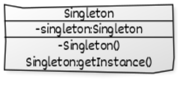

# Singleton

## Définition
**Problème:** On a une classe et on aimerai que l'utilisateur manipule toujours la même instance (pas avoir plusieurs instances ayant des "sauvegardes" différentes).
**Solution:** Il suffit juste de transformer l'objet en Singleton.



## Composition:
- Singleton: La classe qui ne renvoie qu'une seule instance d'elle même
## Exemple:
On peut tester le singleton pour voir s'il renvoit toujours la même instance.

## Définitions	
| classe    | rôle      | description                  |
|-----------|-----------|------------------------------|
| Singleton | Composite | répartie la companie en bloc |
 
## Pseudocode
main () 
	On appelle le singleton 2 fois

## Code
```java
public class TestSingleton{
	public static void main(args[]){ 
		Singleton S1= Singleton.getInstance();
		Singleton S2= Singleton.getInstance();
		//S1 and S2 are the same
	}
}

public final class Singleton {

    private static final Singleton INSTANCE = new Singleton();

    private Singleton() {}

    public static Singleton getInstance() {
        return INSTANCE;
    }
}
```
